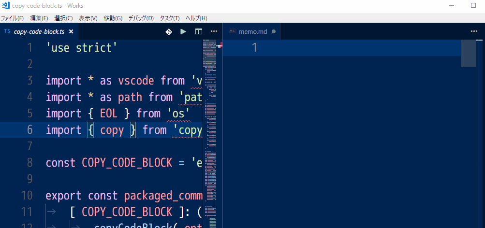
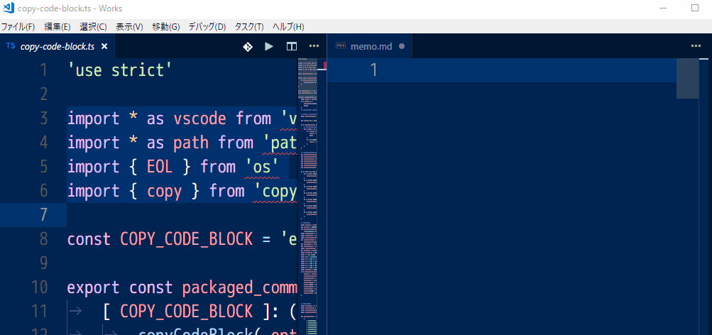

# vscode-copy-code-block
Copy code with filename and line number, customized format.

Copy with linenumber.



Copy markdown format. Use keybinding arguments.



## Available command
* extension.copyCodeBlock: copy cursor line or selections by specified format.

## default keybind
```json
    {
        "key": "alt+j alt+1",
        "command": "extension.copyCodeBlock",
        "args":{
            "formatName": "default"
        }
    },
    {
        "key": "alt+j alt+2",
        "command": "extension.copyCodeBlock",
        "args":{
            "formatName": "markdown"
        }
    },
```

## default format

```json
    "default": [
        {
            "formatName": "default",
            "codeBlockHeaderFormat": "${fullPath}:${topLineNumber}${EOL}",
            "codeBlockFooterFormat": "",
            "codeLineFormat": "${LINENUMBER}: ${CODE}${EOL}",
            "multipleSelectionCreateMultipleCodeBlocks": false,
            "multipleSelectionsBoundalyMarkerFormat": "---${EOL}",
            "forcePathSeparatorSlash": false,
            "forceSpaceIndent": false
        },
        {
            "formatName": "markdown",
            "codeBlockHeaderFormat": "${fullPath}:${topLineNumber}${EOL}```${languageId}${EOL}",
            "codeBlockFooterFormat": "```${EOL}",
            "codeLineFormat": "${CODE}${EOL}",
            "multipleSelectionCreateMultipleCodeBlocks": false,
            "multipleSelectionsBoundalyMarkerFormat": "---${EOL}",
            "forcePathSeparatorSlash": true,
            "forceSpaceIndent": true
        }
    ]
```

The formats can be added and edited.
You can use it by specifying "formatName" with "args" parameter of key binding.

## Configurations

| parameter name                            | description                                                                            | type    | default value                        |
| ----------------------------------------- | -------------------------------------------------------------------------------------- | ------- | ------------------------------------ |
| formatName                                | keybinding  "args" "formatName"                                                        | string  | ""                                   |
| codeBlockHeaderFormat                     | Specifies the format of the code block footer lines.                                   | string  | "${fullPath}:${topLineNumber}${EOL}" |
| codeBlockFooterFormat                     | Code block footer format. The available tokens are the same as codeBlockHeaderFormat." | string  | ""                                   |
| codeLineFormat                            | The available tokens are the following in addition to codeBlockHeaderFormat.           | string  | "${LINENUMBER}: ${CODE}${EOL}"       |
| multipleSelectionCreateMultipleCodeBlocks | If true is specified, multiple selections will generate multiple code blocks.          | boolean | false                                |
| multipleSelectionsBoundalyMarkerFormat    | Delimiter when "multipleSelectionCreateMultipleCodeBlocks" is set to true.             | string  | "---${EOL}"                          |
| forcePathSeparatorSlash                   | Forcibly replace path separator with slash.                                            | boolean | false                                |
| forceSpaceIndent                          | Force space indentation.                                                               | boolean | false                                |


## codeBlockHeaderFormat / codeBlockFooterFormat / codeLineFormat tokens

| token name                      | description                                                   | example                                                |
| ------------------------------- | ------------------------------------------------------------- | ------------------------------------------------------ |
| ${fullPath}                     | File full path.                                               | e:\Works\vscode-copy-code-block\src\copy-code-block.ts |
| ${workspaceFolderRelativePath}  | WorkspaceFolder relative path.                                | src\copy-code-block.ts                                 |
| ${fileBasename}                 | Filename.                                                     | copy-code-block.ts                                     |
| ${fileExtname}                  | File extension.                                               | .ts                                                    |
| ${fileExtnameWithoutDot}        | File extension without '.'.                                   | ts                                                     |
| ${fileBasenameWithoutExtension} | Filename without extension.                                   | copy-code-block                                        |
| ${workspaceFolder}              | workspaceFolder                                               | e:\Works\vscode-copy-code-block                        |
| ${fileDirname}                  | File dir name.                                                | e:\Works\vscode-copy-code-block\src                    |
| ${pathSeparator}                | Path separator. Affected by 'forcePathSeparatorSlash' option. | \                                                      |
| ${osPathSeparator}              | It is not affected by 'forcePathSeparatorSlash' option        | \                                                      |
| ${pathParse.root}               | node.js path.parse() 'root'                                   | e:\                                                    |
| ${pathParse.dir}                | node.js path.parse() 'dir'                                    | e:\Works\vscode-copy-code-block\src                    |
| ${pathParse.base}               | node.js path.parse() 'base'                                   | copy-code-block.ts                                     |
| ${pathParse.ext}                | node.js path.parse() 'ext'                                    | .ts                                                    |
| ${pathParse.name}               | node.js path.parse() 'name'                                   | copy-code-block                                        |
| ${languageId}                   | Language identified by vscode.                                | typescript                                             |
| ${topLineNumber}                | The start of the selection or the line number of the cursor.  | 10                                                     |
| ${YYYY}                         | Current 4-digit year.                                         | 2018                                                   |
| ${MM}                           | Current month. "01"-"12"                                      | 03                                                     |
| ${DD}                           | Current day. "01"-"31"                                        | 28                                                     |
| ${HH}                           | Current hour. "00"-"23"                                       | 00                                                     |
| ${mm}                           | Current minutes. "00"-"59"                                    | 45                                                     |
| ${ss}                           | Current secound. "00"-"59"                                    | 04                                                     |
| ${osEOL}                        | OS-dependent end of line characters.                          | \r\n                                                   |
| ${EOL}                          | end of line characters on vscode.                             | \r\n                                                   |
| ${LF}                           | LF character.                                                 | \n                                                     |
| ${CRLF}                         | CR LF characters.                                             | \r\n                                                   |


## Format Examples

### Plain filename, line number and code lines
```json
    {
        "formatName": "default",
        "codeBlockHeaderFormat": "${fullPath}:${topLineNumber}${EOL}",
        "codeBlockFooterFormat": "",
        "codeLineFormat": "${LINENUMBER}: ${CODE}${EOL}",
        "multipleSelectionCreateMultipleCodeBlocks": false,
        "multipleSelectionsBoundalyMarkerFormat": "---${EOL}",
        "forcePathSeparatorSlash": false,
        "forceSpaceIndent": false
	},
```

```plaintext
	e:\Works\vscode-copy-code-block\src\copy-code-block.ts:10
	10: export const packaged_commands: { [ key: string ]: ( args: any ) => void } = {
	11: 	[ COPY_CODE_BLOCK ]: ( option: any ) => {
	12: 		copyCodeBlock( option )
	13: 	}
	14: }
```

### Markdown code block
```json
    {
        "formatName": "markdown",
        "codeBlockHeaderFormat": "${fullPath}:${topLineNumber}${EOL}```${languageId}${EOL}",
        "codeBlockFooterFormat": "```${EOL}",
        "codeLineFormat": "${CODE}${EOL}",
        "multipleSelectionCreateMultipleCodeBlocks": false,
        "multipleSelectionsBoundalyMarkerFormat": "---${EOL}",
        "forcePathSeparatorSlash": true,
        "forceSpaceIndent": true
	}
```

~~~plaintext
	e:/Works/vscode-copy-code-block/src/copy-code-block.ts:10
	```typescript
	export const packaged_commands: { [ key: string ]: ( args: any ) => void } = {
	    [ COPY_CODE_BLOCK ]: ( option: any ) => {
	        copyCodeBlock( option )
	    }
	}
	```
~~~

### html pre, code element.
```json
    {
        "formatName": "html",
        "codeBlockHeaderFormat": "${fullPath}(${topLineNumber})${EOL}<pre><codde>${EOL}",
        "codeBlockFooterFormat": "</code></pre>${EOL}",
        "codeLineFormat": "${CODE}${EOL}",
        "multipleSelectionCreateMultipleCodeBlocks": false,
        "multipleSelectionsBoundalyMarkerFormat": "---${EOL}",
        "forcePathSeparatorSlash": true,
        "forceSpaceIndent": true
    }
```

```html
	e:/Works/vscode-copy-code-block/src/copy-code-block.ts:10
	<pre><codde>
	export const packaged_commands: { [ key: string ]: ( args: any ) => void } = {
	    [ COPY_CODE_BLOCK ]: ( option: any ) => {
	        copyCodeBlock( option )
	    }
	}
	</code></pre>
```

## Acknowledgments

This extension was inspired by the [Copy With Line Numbers](https://marketplace.visualstudio.com/items?itemName=yassh.copy-with-line-numbers).


